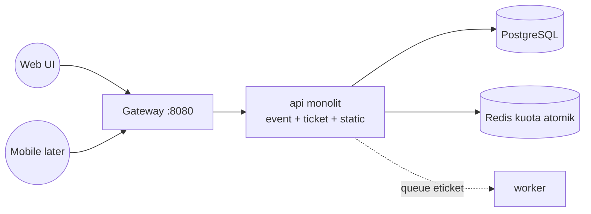

# War Tiket Konser — Klpk1

Praktikum **Scalable Systems Design** · Tema war tiket · **Data K-pop Korea** (bukan copy dataset lab lain).

Pola repo mengikuti lab microservices (gateway · services · openapi · ADR · compose),  
implementasi **revisi Jumat**: backend monolit `event + ticket + web`.

---

## Context Map



> Panah penuh = request sinkron. Putus-putus = async Redis list.

---

## Services (mapping)

| Komponen | Port / role | Tanggung jawab | Data |
|----------|-------------|----------------|------|
| `gateway` (Nginx) | **8080** | Entry Web/API, siap scale | — |
| `api` | 3000 internal | Event catalog, denah, **POST /orders** anti-oversell, web UI | events, seats, orders |
| `worker` | — | Konsumsi antrean e-ticket | audit |
| `postgres` | internal | Persist catalog + order | `wtk` DB |
| `redis` | internal | **Kuota kursi atomik** + cache + queue | keys `quota:*` |

Aturan: **sumber daya rebutan = kursi** → hanya dipotong atomik di Redis (lihat ADR-002).

Ditunda (sesuai revisi Jumat): `payment-service`, `notification-service` eksternal, payment gateway.

---

## Data domain (Korea — milik squad ini)

| ID | Artis | Venue | Kursi |
|----|--------|--------|------:|
| 1 | BTS | Busan Asiad Main Stadium | 500 |
| 2 | SEVENTEEN | KSPO DOME, Seoul | 400 |
| 3 | NewJeans | Inspire Arena, Incheon | 300 |
| 4 | IU | Jamsil Indoor Stadium | 280 |

Total denah: **1480** seat codes · folder `data/`.

```bash
npm run data:korea   # generate CSV + load Postgres/Redis
```

---

## Kontrak API

| File | Versi | Status |
|------|-------|--------|
| [`openapi.yaml`](./openapi.yaml) | 1.0.0 | Development |
| [`openapi-final.yaml`](./openapi-final.yaml) | 2.0.0 | Draft beku (P4) |

### Endpoint kritis

| Endpoint | Keterangan |
|----------|------------|
| `GET /events` | Daftar konser + paginasi |
| `GET /events/{id}` | Detail + seats + **sisa live** |
| `POST /orders` | **Panas** — lock kuota, 409 jika habis |
| `GET /health` | Instance id (bukti replika) |

Web UI: `http://localhost:8080/` · API sama host.

---

## ADR

| ADR | Keputusan |
|-----|-----------|
| [ADR-001](./docs/adr/ADR-001-pagination.md) | Paginasi wajib |
| [ADR-002](./docs/adr/ADR-002-seat-lock-redis.md) | Redis Lua anti-oversell |
| [ADR-003](./docs/adr/ADR-003-monolit-revisi-jumat.md) | Monolit dulu untuk Jumat |

---

## Menjalankan

```bash
# salin env
copy .env.example .env

docker compose up -d --build
docker compose ps

curl -s http://localhost:8080/health
curl -s http://localhost:8080/events/1
# buka browser
start http://localhost:8080/
```

Load data Korea (setelah DB up):

```bash
docker compose exec api node data/generate-real-seats.js
docker compose exec api node src/load-manual-data.js
```

Scale API (P2):

```bash
docker compose up -d --scale api=3
```

Dev tanpa Docker image app (Postgres/Redis container + Node lokal):

```bash
npm install
npm run data:korea
npm start
# http://localhost:3000/
```

---

## Struktur repo

```
├── docker-compose.yml
├── .env.example
├── openapi.yaml / openapi-final.yaml
├── nginx/default.conf          # gateway
├── services/api/Dockerfile     # build context = root
├── src/                        # kode backend
├── public/                     # web Jumat
├── data/                       # events + seats Korea
├── db/init.sql
├── docs/adr/
├── loadtest/
├── AI-LOG.md
└── PERAN.md
```

---

## Peran

Lihat [`PERAN.md`](./PERAN.md). AI usage: [`AI-LOG.md`](./AI-LOG.md).
