# Langkah-Langkah Arsitek Sistem — War Tiket Konser

**Tema:** Penjualan tiket dengan antrean virtual dan kursi terbatas  
**Sumber daya rebutan:** Kursi — satu kursi hanya boleh terjual satu kali  
**Mata kuliah:** Praktikum Scalable Systems Design  
**Peran terkait:** Arsitek Sistem (Andi Hilyatul Mar'ah) → lalu diserahkan ke Backend, Data, Infra, QA

---

## Ringkasan peran layanan (dari brief)

| Layanan | Tanggung jawab | Data yang dimiliki |
|---------|----------------|--------------------|
| `event-service` | Kelola konser, jadwal, kategori kursi, harga | Event, venue, denah kursi, kuota per kategori |
| `ticket-service` | Kunci kursi sementara, konfirmasi, lepas kunci saat kedaluwarsa | Status tiap kursi, kunci sementara + waktu kedaluwarsa |
| `payment-service` | Terima pembayaran, konfirmasi, batalkan bila gagal/lewat waktu | Transaksi, status bayar, riwayat pembayaran |
| `notification-service` | Kirim e-ticket, pengingat, pemberitahuan gagal bayar | Antrean pesan keluar dan riwayat pengiriman |

---

# BAGIAN A — Langkah kerja Arsitek Sistem (urutan wajib)

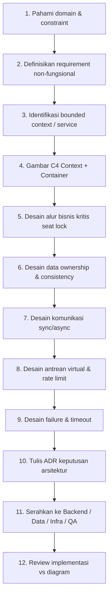

### Detail tiap langkah

| No | Langkah | Output yang harus ada |
|----|---------|------------------------|
| 1 | Domain & constraint | Satu kursi = 1 penjualan; peak traffic saat buka jual |
| 2 | NFR | Latency, throughput, availability, consistency seat |
| 3 | Service boundary | 4 service di atas + API Gateway + Queue + Cache |
| 4 | Diagram C4 | Context, Container (file ini) |
| 5 | Flow kritis | Sequence: join queue → pilih kursi → lock → bayar → confirm |
| 6 | Data ownership | Siapa master data seat/payment; no dual-write sembarangan |
| 7 | Sync vs async | REST untuk request user; event/queue untuk notifikasi & timeout |
| 8 | Virtual queue | FIFO / token bucket; cegah stampede ke DB |
| 9 | Failure | Payment timeout → unlock seat; idempotency key |
| 10 | ADR | Keputusan: Redis lock? DB row lock? Outbox pattern? |
| 11 | Handoff | Backend endpoint, Data schema, Infra docker/compose, QA skenario load |
| 12 | Review | Diagram = source of truth; ubah kode → update diagram |

---

# BAGIAN B — Diagram arsitektur

## B1. System Context (C4 Level 1)

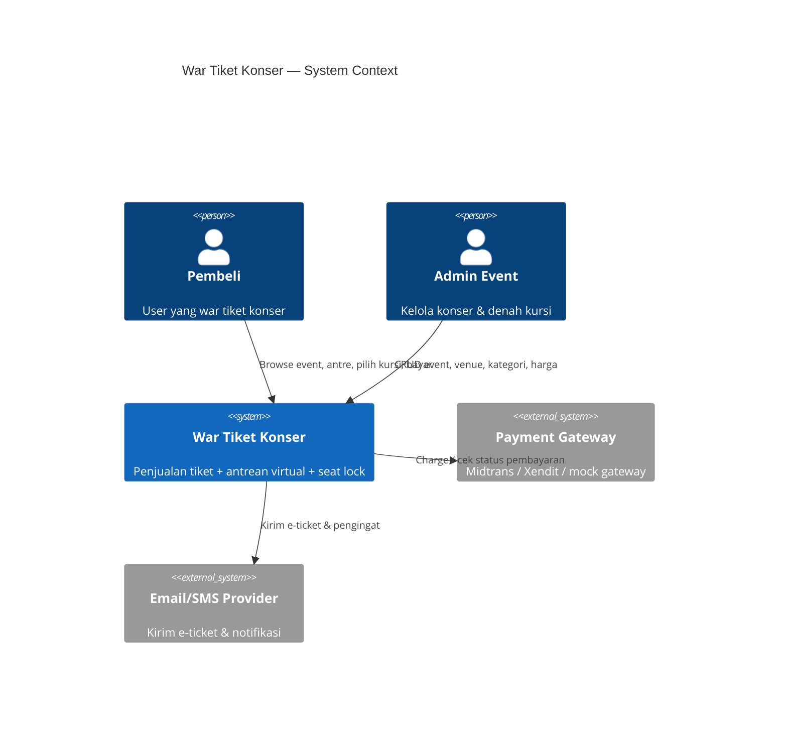

## B2. Container Diagram (C4 Level 2) — inti arsitektur

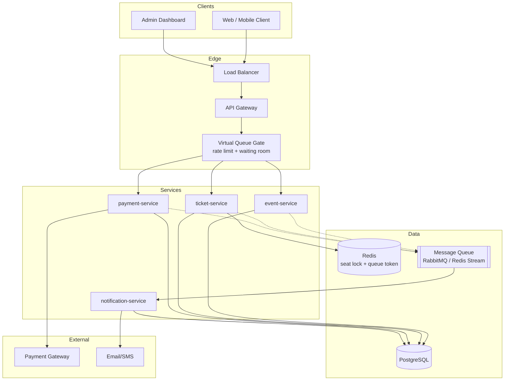

## B3. Component per service (ringkas)

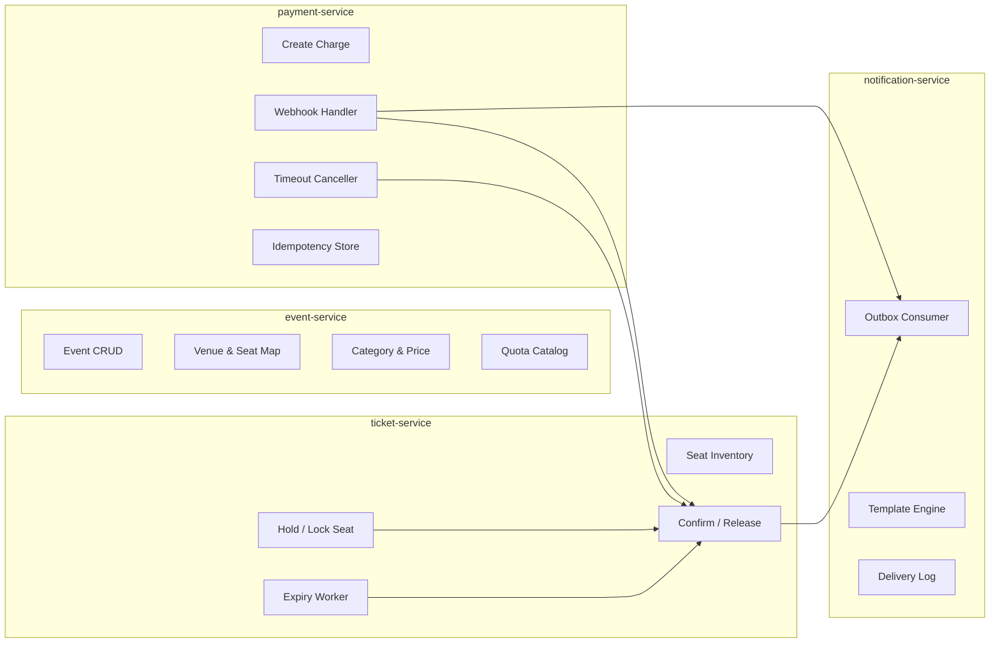

---

# BAGIAN C — Flowchart / sequence alur bisnis kritis

## C1. Happy path: dari buka halaman sampai e-ticket

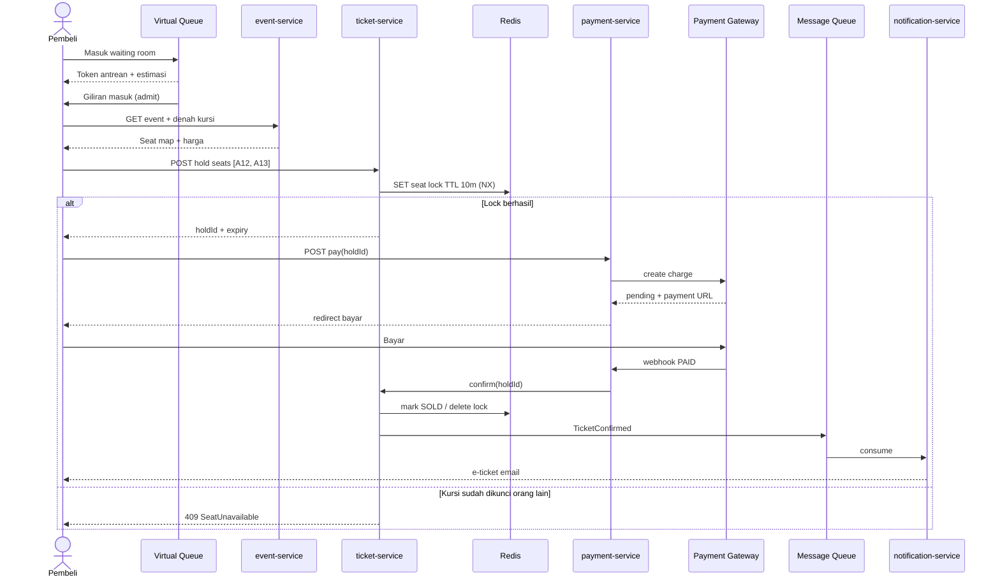

## C2. Flowchart keputusan seat lock (sumber daya rebutan)

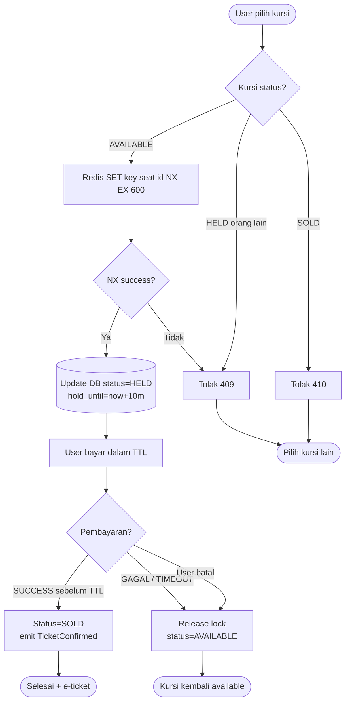

## C3. Flowchart antrean virtual (cegah stampede)

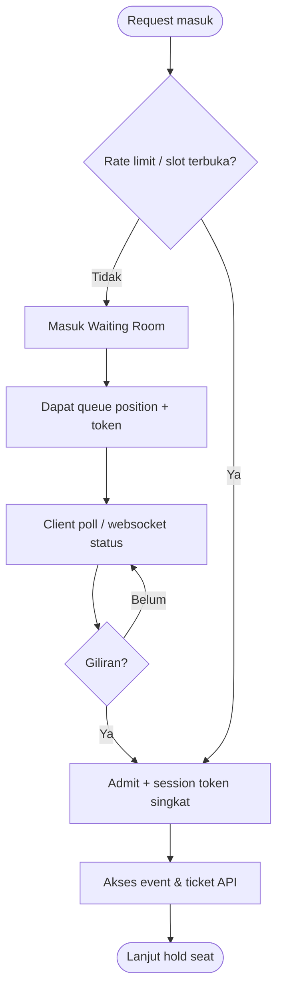

## C4. Flowchart payment timeout & kompensasi

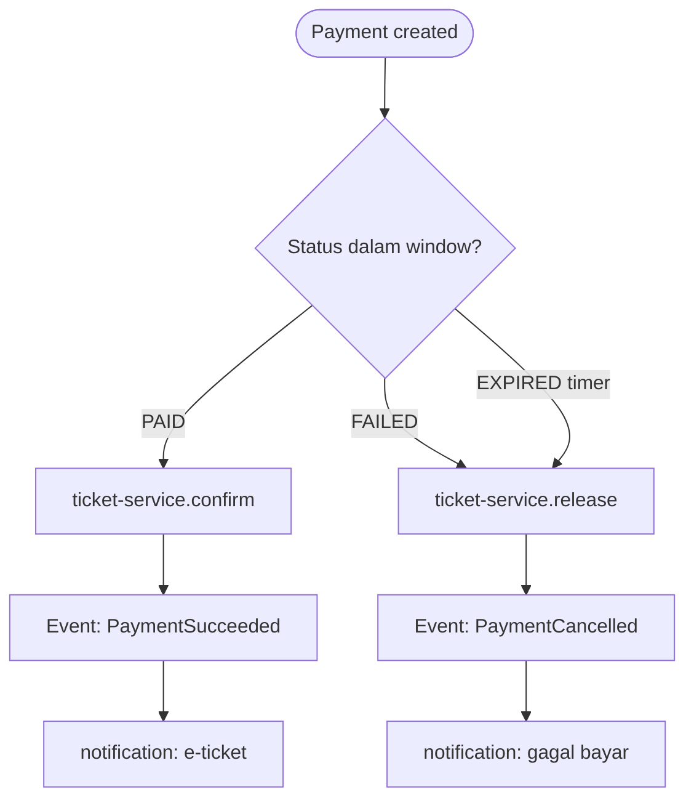

## C5. State machine status kursi

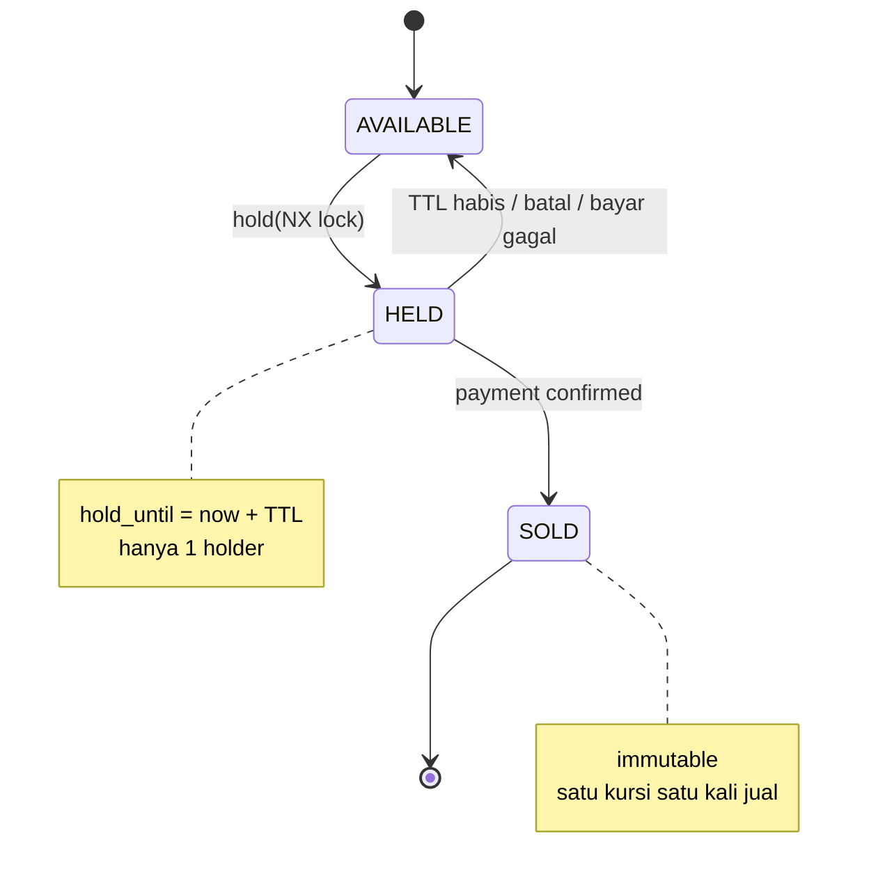

---

# BAGIAN D — Data ownership & consistency

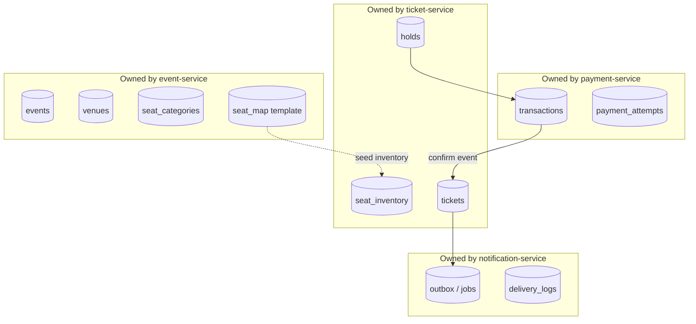

### Aturan konsistensi (wajib ditulis di ADR)

1. **Seat = single source of truth di `ticket-service`** (+ Redis lock sebagai fast path).
2. **Lock harus atomic** (`SET NX EX` atau DB `SELECT FOR UPDATE SKIP LOCKED`).
3. **Confirm pembayaran idempotent** (webhook bisa double-delivery).
4. **Never trust client** untuk status kursi; selalu cek server.
5. **Komunikasi antar service:**  
   - Sync (HTTP): hold, pay, get event  
   - Async (queue): notifikasi, eventual side-effects  
6. **Saga/kompensasi sederhana:** pay fail → release hold (bukan 2PC distributed).

---

# BAGIAN E — Deployment view (untuk handoff Infra/DevOps)

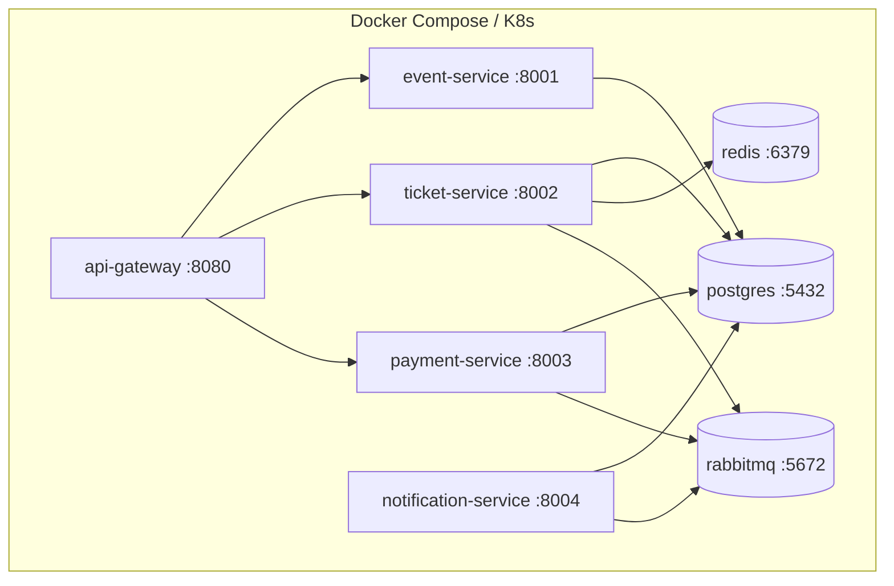

---

# BAGIAN F — Checklist deliverable Arsitek Sistem

- [ ] Context diagram (siapa user, sistem eksternal)
- [ ] Container diagram (service + DB + cache + queue)
- [ ] Sequence happy path war tiket
- [ ] Flowchart seat lock & race condition handling
- [ ] State diagram status kursi
- [ ] Virtual queue flowchart
- [ ] Payment timeout / kompensasi
- [ ] Data ownership per service
- [ ] NFR tertulis (contoh di bawah)
- [ ] Minimal 2 ADR (contoh template di file `02-adr-template.md`)
- [ ] API contract outline (endpoint utama)
- [ ] Handoff notes ke tiap peran

---

# BAGIAN G — NFR awal (boleh disesuaikan kelompok)

| Aspek | Target usulan |
|-------|----------------|
| Correctness seat | 0 double-sell (properti paling kritis) |
| Hold TTL | 5–15 menit (default 10 menit) |
| p95 hold seat | < 200 ms (dengan Redis) |
| Peak concurrent | sesuai skenario load test QA |
| Availability path baca event | tinggi (boleh cache) |
| Payment | at-least-once webhook + idempotent handler |
| Observability | request-id, metrics hold success/fail, queue wait time |

---

# BAGIAN H — Outline API (untuk Backend)

### event-service
- `GET /events` — daftar konser
- `GET /events/{id}` — detail + kategori harga
- `GET /events/{id}/seat-map` — denah & status ringkas
- `POST /admin/events` — buat event (admin)

### ticket-service
- `POST /holds` — body: `eventId`, `seatIds[]` → `holdId`, `expiresAt`
- `DELETE /holds/{holdId}` — batalkan manual
- `POST /holds/{holdId}/confirm` — internal, dipanggil payment-service
- `GET /seats?eventId=` — status kursi (available/held/sold)

### payment-service
- `POST /payments` — body: `holdId` → `paymentId`, `checkoutUrl`
- `POST /payments/webhook` — callback gateway
- `GET /payments/{id}` — status

### notification-service
- internal consumer only (+ optional `GET /notifications/health`)

### Virtual queue / gateway
- `POST /queue/join` → `queueToken`, `position`
- `GET /queue/status` → `admitted`, `position`
- Header wajib setelah admit: `X-Queue-Token` / session

---

# BAGIAN I — Handoff ke peran lain

| Peran | Yang diterima dari Arsitek |
|-------|----------------------------|
| **Backend/API** | Sequence + endpoint + aturan lock/confirm |
| **Data & Persistence** | Ownership tabel, indeks seat, TTL hold, migrasi |
| **Infrastructure & DevOps** | Container diagram, port, Redis/Postgres/MQ, healthcheck |
| **QA / Load-test** | Skenario: 1000 user hold kursi sama; webhook double; TTL expiry |

---

# BAGIAN J — Urutan kerja kelompok (rekomendasi sprint)

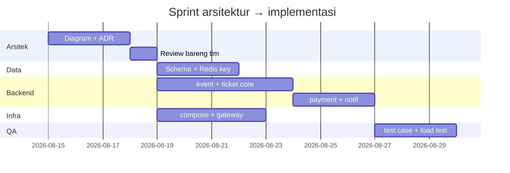

---

## Catatan penting untuk Arsitek

1. **Jangan over-engineering** di praktikum: 4 service + gateway + Redis + Postgres + 1 queue sudah cukup.
2. Fokus demo yang dinilai: **tidak ada double-sell** + **antrean virtual** + **hold timeout**.
3. Setiap keputusan besar → 1 halaman ADR (mengapa Redis lock, mengapa TTL 10 menit, dll).
4. Diagram di file ini = kontrak; kalau implementasi beda, **update diagram dulu atau bareng**.
