# War Tiket Konser — Diagram Arsitek Sistem

**Penjualan tiket + antrean virtual + kursi terbatas** (satu kursi hanya terjual sekali)

> Gambar PNG di folder [`diagrams/`](./diagrams/) · sumber Mermaid live: blok di bawah · HTML lokal: [`diagrams.html`](./diagrams.html)

| # | Diagram | PNG |
|---|---------|-----|
| 1 | Langkah arsitek | [01-langkah.png](./diagrams/01-langkah.png) |
| 2 | Container | [02-container.png](./diagrams/02-container.png) |
| 3 | Seat lock | [03-seat-lock.png](./diagrams/03-seat-lock.png) |
| 4 | Virtual queue | [04-virtual-queue.png](./diagrams/04-virtual-queue.png) |
| 5 | Sequence | [05-sequence.png](./diagrams/05-sequence.png) |
| 6 | State kursi | [06-state.png](./diagrams/06-state.png) |
| 7 | Monolit lab | [07-monolit.png](./diagrams/07-monolit.png) |

---

## 1. Langkah kerja Arsitek Sistem

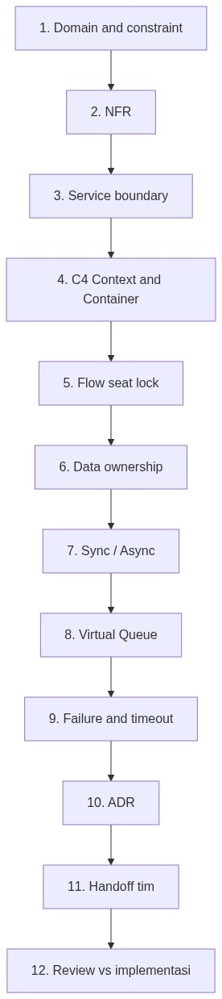

1. Pahami domain & constraint (kursi = sumber daya rebutan)
2. Definisikan NFR (correctness seat, latency, peak load)
3. Bagi bounded context → service
4. Gambar Context + Container diagram
5. Desain alur kritis: hold → pay → confirm
6. Data ownership & konsistensi
7. Sync vs async (REST + queue notifikasi)
8. Antrean virtual & rate limit
9. Failure path: timeout bayar → unlock
10. Tulis ADR → handoff Backend / Data / Infra / QA

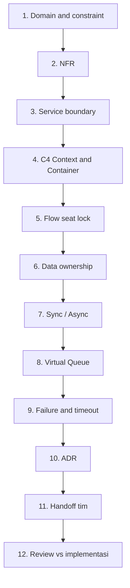

---

## 2. Container architecture

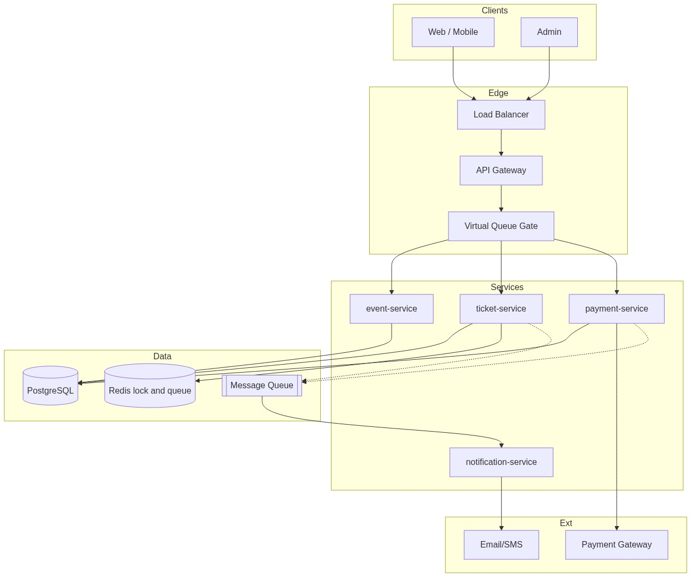

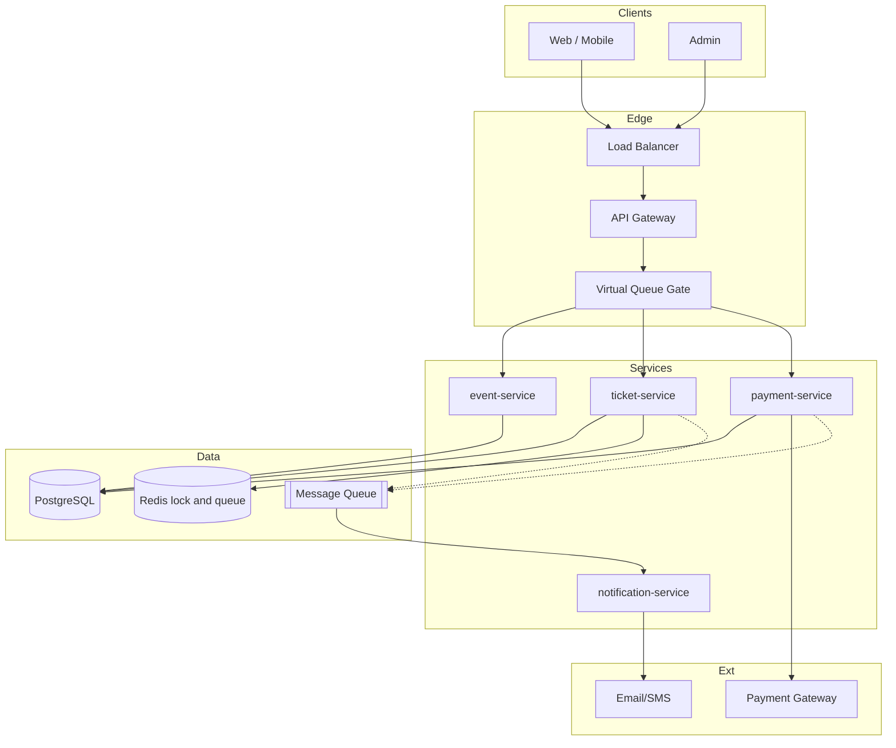

---

## 3. Flowchart seat lock (inti sistem)

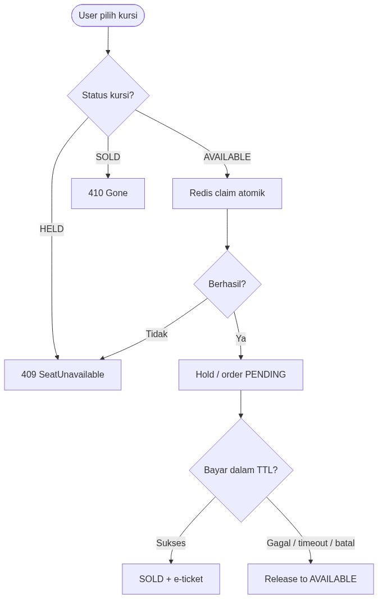

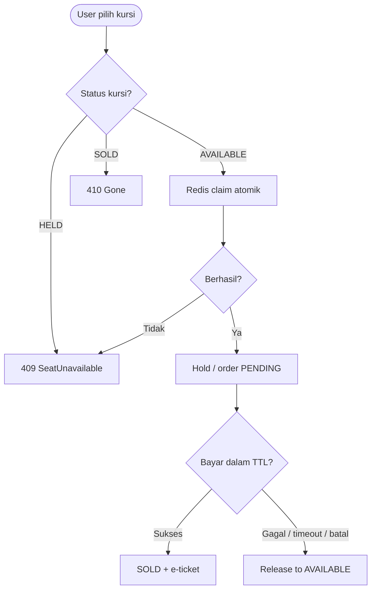

---

## 4. Antrean virtual

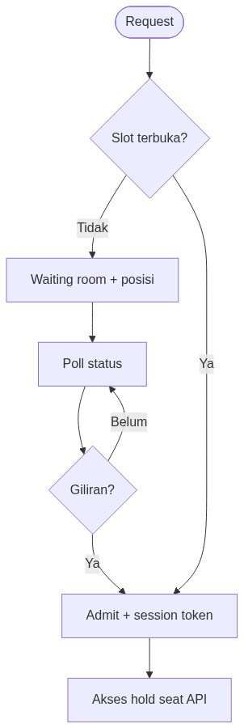

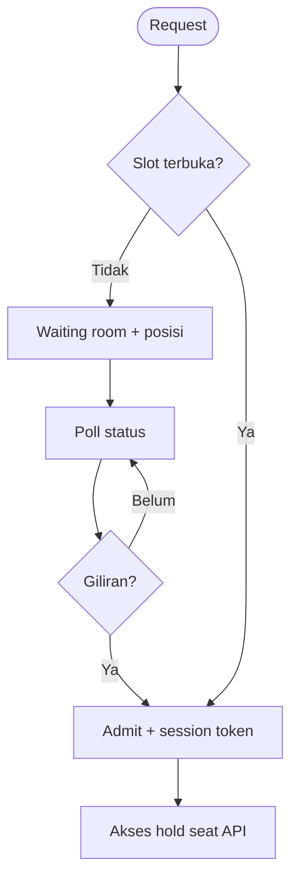

---

## 5. Sequence happy path

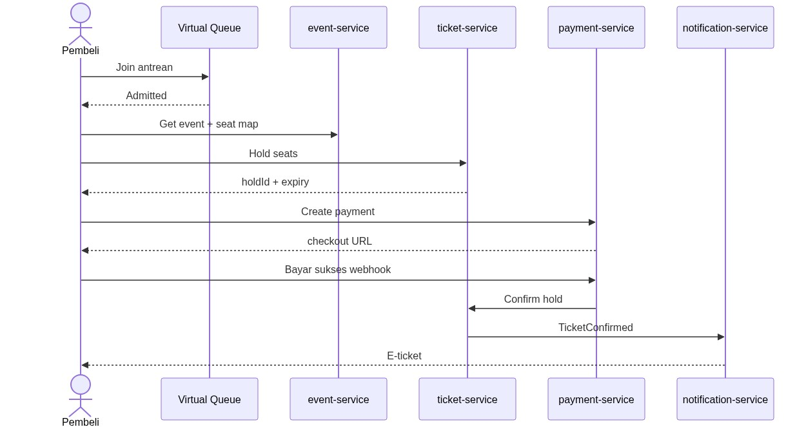

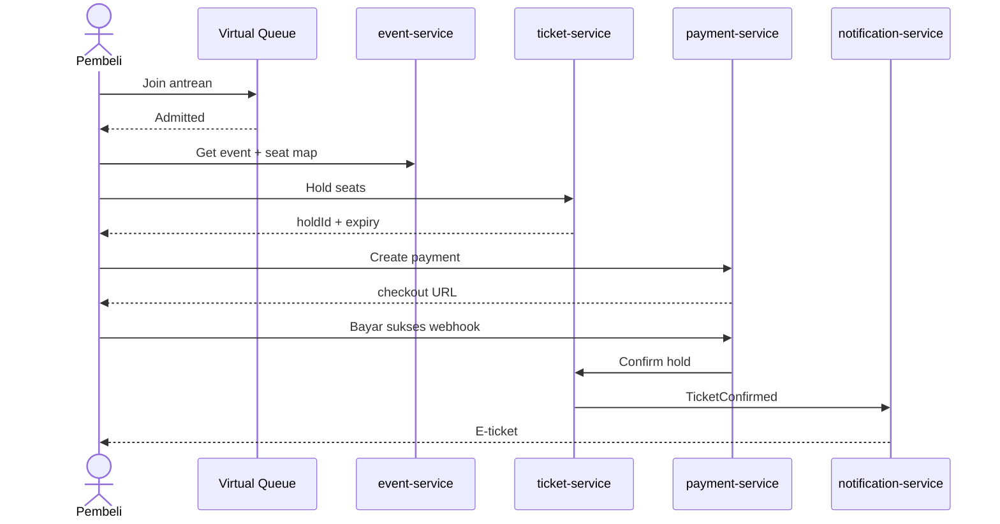

---

## 6. State mesin kursi

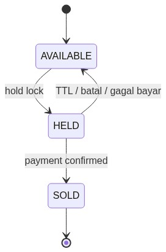

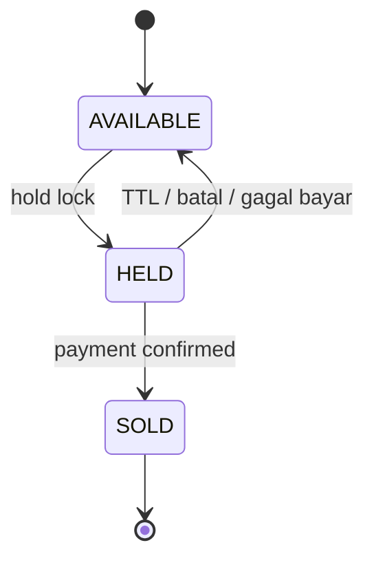

Dokumen: [`01-langkah-arsitek-sistem.md`](./01-langkah-arsitek-sistem.md) · [`02-adr-template.md`](./02-adr-template.md) · [`../docs/adr/`](../docs/adr/)

---

## 7. Monolit lab (implementasi saat ini)

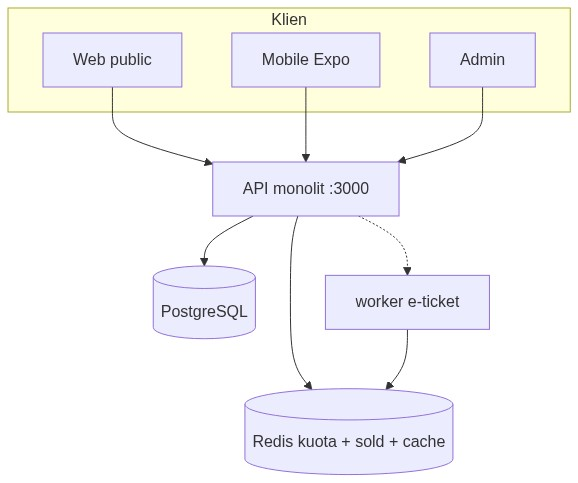

Jalur demo Klpk1: **satu API monolit** (`src/`) + Postgres + Redis. Target 4-service tetap di §2–6 dan `docker-compose.ms.yml`.

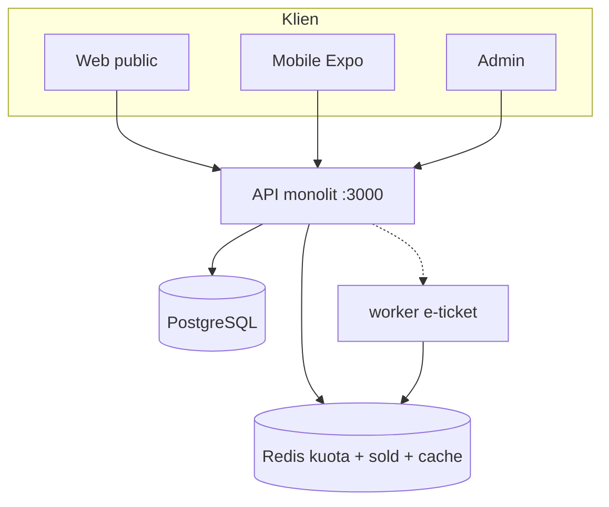
